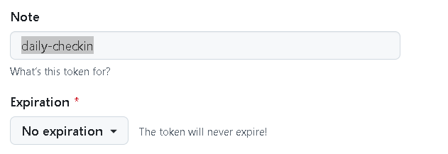
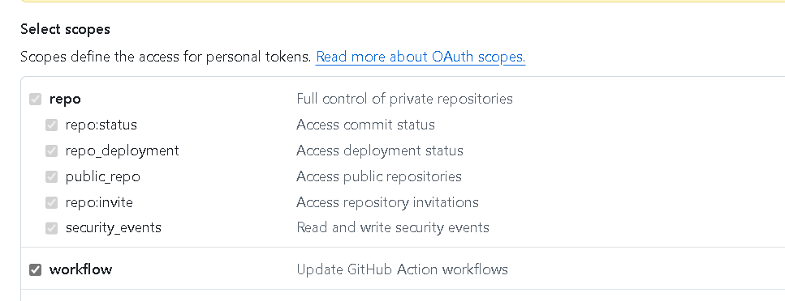
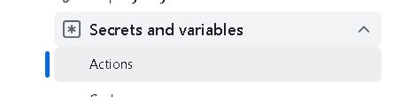

# Github-Automatic-check-in（GitHub 自动签到）

> 每天自动提交一次记录，写入 GitHub 贡献图（Contribution Graph），让 GitHub Streak 保持不间断。

功能特性：
- 随机生成每日心情、状态等信息
- 按照年/月自动归档日志

> [!NOTE]
> 这里的"签到"是每天自动向仓库提交一次 commit，记录到 GitHub 的贡献记录（Contribution Graph）。在 **GitHub Streak** 中即可看到连续提交不间断的记录。

---

## ⏳ 自动签到状态

<!-- CHECKIN_START -->
连续签到：98 天  
最近签到：2026-08-28  
状态：持续中 🚀
<!-- CHECKIN_END -->

---

## 📦 最新版本

<!-- RELEASE_START -->
### [v2.1.1](https://github.com/TravelTibet/Github-Automatic-check-in/releases/tag/v2.1.1) · 2026-07-30

fix bugs
<!-- RELEASE_END -->

---

## 配置过程

### 第一步：Fork 本仓库

点击右上角 **Fork** 按钮，将本仓库 Fork 到你自己的账号下。

> [!IMPORTANT]
> Fork 完成后，**必须先启用 Actions**：
> 1. 进入你 Fork 后的仓库
> 2. 点击顶部 **Actions** 标签页
> 3. 点击绿色按钮 **"I understand my workflows, go ahead and enable them"**
>
> ⚠️ 如果跳过这一步，GitHub 默认禁用 Fork 仓库的 Actions，自动签到将**永远不会运行**。

---

### 第二步：生成个人访问 Token（PAT）

1. 登录 GitHub，进入 **Settings > Developer settings > Personal access tokens > Tokens (classic)**
2. 点击 **Generate new token (classic)**
3. 填写信息：
   - **Note**：填写 `daily-checkin`
   - **Expiration**：选择 `No expiration`（永不过期）

   

4. 勾选以下权限：
   - ✅ `repo`（完全控制仓库）
   - ✅ `workflow`（允许操作 Actions）

   

5. 点击 **Generate token**，生成后**立即复制保存 Token 值**。

> [!WARNING]
> Token 只会显示一次，离开页面后无法再次查看，请务必及时保存。

---

### 第三步：将 PAT 添加到仓库 Secrets

1. 进入你 Fork 后的仓库，点击 **Settings > Secrets and variables > Actions**

   

2. 点击 **New repository secret**，填写：
   - **Name**：`DAILY_CHECKIN`（名称必须完全一致，区分大小写）
   - **Secret**：粘贴刚才保存的 PAT

3. 点击 **Add secret** 保存。

> [!NOTE]
> 脚本会通过这个 Token 自动识别你的 GitHub 用户名和邮箱，**无需手动修改任何代码**。

---

### 第四步：验证是否成功

配置完成后，可以手动触发一次测试：

1. 点击仓库顶部 **Actions** 标签页
2. 左侧选择 **Dailyly** workflow
3. 点击右侧 **Run workflow > Run workflow**

几秒后刷新页面，如果显示 ✅ 绿色对勾，说明配置成功，之后会每天自动运行。

如果显示 ❌ 红色，点进去查看日志，常见错误：
- `remote: Permission denied` → Secret 名称填错，或 PAT 权限不足
- `GH007` → 进入 **[Settings > Emails](https://github.com/settings/emails)**，关闭 **"Block command line pushes that expose my email address"** 选项，或将邮箱设为公开

---

## 🔔 订阅更新通知

本仓库会不定期发布新版本，修复问题或新增功能。由于每天都有自动签到提交，**建议只订阅 Release 通知**，避免被日常 commit 打扰：

1. 点击仓库页面右上角 **Watch** 下拉按钮
2. 选择 **Custom**
3. **只勾选 Releases**，取消其他选项
4. 点击 **Apply**

完成后，每当有新版本发布时你会收到一条 GitHub 通知，日常的签到提交不会有任何打扰。

---

## 🔄 如何更新到新版本

收到新版本通知后，进入你自己 Fork 的仓库：

1. 点击仓库名称下方的 **"This branch is N commits behind"** 提示
2. 点击 **Sync fork → Update branch**

同步完成后代码自动更新，无需重新配置 Secret，**已有的签到记录也不受影响**。

---

## Star History

<a href="https://www.star-history.com/?repos=TravelTibet%2FGithub-Automatic-check-in%2CGithub-Automatic-check-in%2FGithub-Automatic-check-in&type=date&legend=bottom-right">
 <picture>
   <source media="(prefers-color-scheme: dark)" srcset="https://api.star-history.com/chart?repos=TravelTibet/Github-Automatic-check-in%2CGithub-Automatic-check-in/Github-Automatic-check-in&type=date&theme=dark&legend=bottom-right&sealed_token=q6Y57qSP9rHrvdl8bkDczAnjoM4oI1xEHpYkvkRbYT759o9Mnx74hXqOvSxyVrbbwTJRcbmakBAu0FBHMwmilGQnaEa0an8up5My562LT30GJU5VhLxXugIC6eoqe6MDPAQKILQJBfVSN5P9piVGvfNxuRHyG0XsOrFKHSA-jQlPclsrrwf0oJxfsyOv" />
   <source media="(prefers-color-scheme: light)" srcset="https://api.star-history.com/chart?repos=TravelTibet/Github-Automatic-check-in%2CGithub-Automatic-check-in/Github-Automatic-check-in&type=date&legend=bottom-right&sealed_token=q6Y57qSP9rHrvdl8bkDczAnjoM4oI1xEHpYkvkRbYT759o9Mnx74hXqOvSxyVrbbwTJRcbmakBAu0FBHMwmilGQnaEa0an8up5My562LT30GJU5VhLxXugIC6eoqe6MDPAQKILQJBfVSN5P9piVGvfNxuRHyG0XsOrFKHSA-jQlPclsrrwf0oJxfsyOv" />
   
 </picture>
</a>
